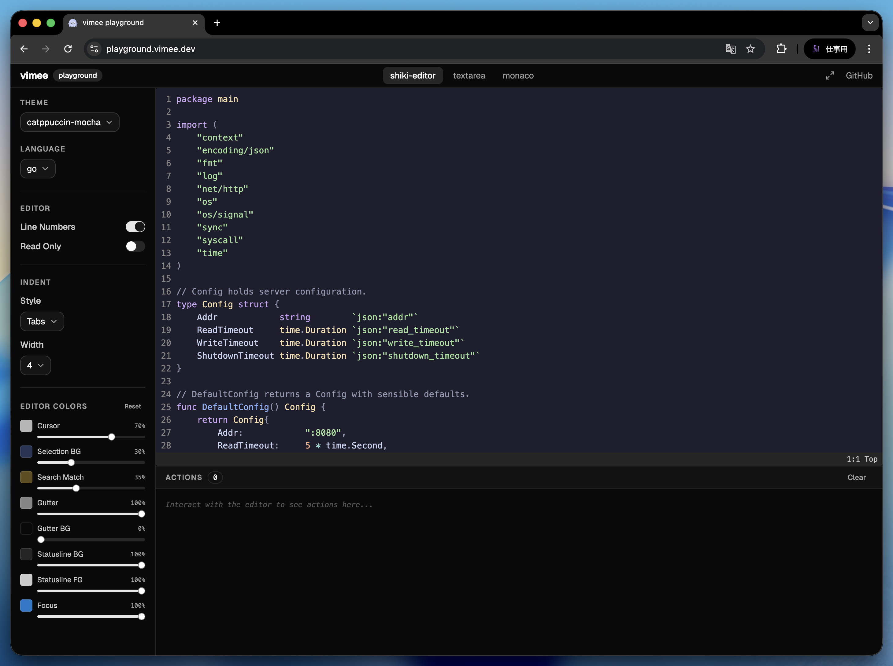

# vimee playground

An interactive playground for [@vimee/shiki-editor](https://github.com/vimeejs) — try the vim editor in your browser, tweak settings, and inspect every action in real time.



**Live:** [playground.vimee.dev](https://playground.vimee.dev)

## Features

- **Vim editor** powered by `@vimee/shiki-editor` with full syntax highlighting via [Shiki](https://shiki.matsu.io/)
- **Theme switcher** — catppuccin-mocha, dracula, nord, tokyo-night, and more
- **Language selector** — Go, TypeScript, JavaScript, Python, Rust, HTML, CSS, JSON, Markdown, Bash
- **Editor options** — toggle line numbers, read-only mode, indent style (tabs/spaces), indent width
- **Editor color controls** — customize `--sv-*` CSS variables (cursor, selection, gutter, statusline, focus) with color pickers and alpha sliders
- **Action log** — every vim action (`cursor-move`, `content-change`, `mode-change`, `yank`, `save`, etc.) is logged in reverse chronological order with keystroke and payload details

## Tech stack

- [React](https://react.dev/) 19
- [Vite](https://vite.dev/) 8
- [Tailwind CSS](https://tailwindcss.com/) v4
- [shadcn/ui](https://ui.shadcn.com/) (Radix UI)
- [Shiki](https://shiki.matsu.io/) v4

## Local development

### Prerequisites

- [Bun](https://bun.sh/) (v1.2+)

### Setup

```bash
# Clone the repository
git clone https://github.com/vimeejs/playground.git
cd playground

# Install dependencies
bun install

# Start the dev server
bun run dev
```

The dev server starts at [http://localhost:5173](http://localhost:5173).

### Build

```bash
bun run build
```

Output is written to `dist/`. You can preview the production build with:

```bash
bun run preview
```

## License

MIT
